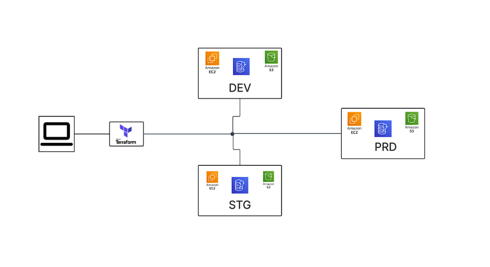

<p align="center">
  
</p>

<h1 align="center"><strong>Terraform Multi-Environment AWS Infrastructure Deployment</strong></h1>

<p align="center">
  A modular, reusable, and scalable <strong>Terraform</strong> project for provisioning <strong>AWS infrastructure</strong> across multiple environments such as <code>dev</code>, <code>staging</code>, and <code>prod</code>.
</p>

<p align="center">
  It provisions <strong>EC2</strong>, <strong>S3</strong>, and <strong>DynamoDB</strong> resources using Infrastructure as Code (IaC).
</p>

---
## 📁 **Project Structure**

```bash
.
├── infra-eks-app/            # Reusable Terraform module
│   ├── dynamodb.tf           # DynamoDB resource configuration
│   ├── ec2.tf                # EC2 resource configuration
│   ├── s3.tf                 # S3 bucket resource configuration
│   └── variables.tf          # Module input variables
├── main.tf                   # Environment-specific module instantiation
├── providers.tf              # AWS provider configuration
├── terraform.tf              # Optional backend config (e.g., remote state)
├── terraform.tfstate         # Local state file (DO NOT COMMIT)
├── terraform.tfstate.backup  # Auto-generated backup state file
├── teraa-key                 # EC2 private key (DO NOT COMMIT)
└── teraa-key.pub             # EC2 public key

```

----------

## 🚀 **Features**

-   ✅ Modular and reusable infrastructure setup
-   ✅ Multi-environment support (`dev`, `staging`, `prod`)
-   ✅ Dynamic resource configuration via `variables.tf`
-   ✅ EC2 provisioning with custom AMI, instance type, and count
-   ✅ S3 bucket creation for object storage
-   ✅ DynamoDB table setup with user-defined hash key
-   ✅ Secure key-pair support for EC2 access
-   ✅ Easily extendable to include **any AWS service**

----------

## 🧱 **How It Works**

-   **Module (`infra-eks-app`)**: Contains reusable logic for EC2, S3, and DynamoDB resources
-   **`main.tf`**: Instantiates the module with environment-specific values
-   **`variables.tf`**: Defines input variables for customization
-   **`providers.tf`**: Configures AWS provider with region and credentials

----------

## ⚙️ **Usage**

1️⃣ **Initialize the project**

```bash
terraform init

```

2️⃣ **Review the execution plan**

```bash
terraform plan

```

3️⃣ **Apply the configuration**

```bash
terraform apply

```

4️⃣ **Destroy the infrastructure**

```bash
terraform destroy

```

----------

## 📦 **Module Usage Example**

```hcl
module "dev-infra" {
  source         = "./infra-eks-app"
  env            = "dev"
  bucket_name    = "tws-infra-app-bucket"
  instance_count = 1
  instance_type  = "t2.micro"
  ec2_ami_id     = "ami-020cba7c55df1f615"
  hash_key       = "studentID"
}

```

To support multiple environments, replicate this block with different values:

```hcl
module "staging-infra" {
  source         = "./infra-eks-app"
  env            = "staging"
  bucket_name    = "staging-app-bucket"
  instance_count = 2
  instance_type  = "t3.micro"
  ec2_ami_id     = "ami-0abcdef1234567890"
  hash_key       = "userID"
}

```

----------

## ➕ **Add Any AWS Service**

This project is designed to be **extensible**. You can easily add support for other AWS services by creating new `.tf` files inside the module folder.

### 🛠️ Example: Add RDS

```hcl
resource "aws_db_instance" "app_db" {
  identifier          = "${var.env}-db"
  engine              = "mysql"
  instance_class      = "db.t3.micro"
  allocated_storage   = 20
  username            = "admin"
  password            = var.db_password
  skip_final_snapshot = true
}

```

### 📊 Example: Add CloudWatch Alarms

```hcl
resource "aws_cloudwatch_metric_alarm" "cpu_alarm" {
  alarm_name          = "${var.env}-high-cpu"
  comparison_operator = "GreaterThanThreshold"
  evaluation_periods  = "2"
  metric_name         = "CPUUtilization"
  namespace           = "AWS/EC2"
  period              = "120"
  statistic           = "Average"
  threshold           = "70"
  alarm_description   = "Alarm when CPU exceeds 70%"
  dimensions = {
    InstanceId = aws_instance.my-ec2-instance.id
  }
}

```

> Be sure to update `variables.tf` to expose any required input and pass them in `main.tf`.

----------

## 🧭 **Architecture Diagram**

<p align="center">  </p>

> Replace `YOUR_DIAGRAM_URL_HERE` with the actual link to your diagram (e.g., hosted on GitHub, Imgur, or any CDN).

----------

## 📌 **Best Practices**

-   🔒 **Never commit sensitive files**, such as:
    
    -   `teraa-key`
    -   `terraform.tfstate`
    -   `.terraform/`
-   ☁️ Use **remote backends** (e.g., S3 + DynamoDB) for secure state management
    
-   🧪 Test in `dev` before promoting changes to `staging` or `prod`
    
-   📁 Isolate environments using workspaces or folder-based structures
    

----------

## 🔐 **Security Tips**

-   ❌ Never push private keys (`teraa-key`) to version control
-   🔁 Rotate EC2 key-pairs periodically
-   🔐 Use IAM roles with least privilege access

----------

## 📄 **License**

This project is licensed under the **MIT License**.  
Feel free to use, modify, and adapt it for your infrastructure needs.

----------
